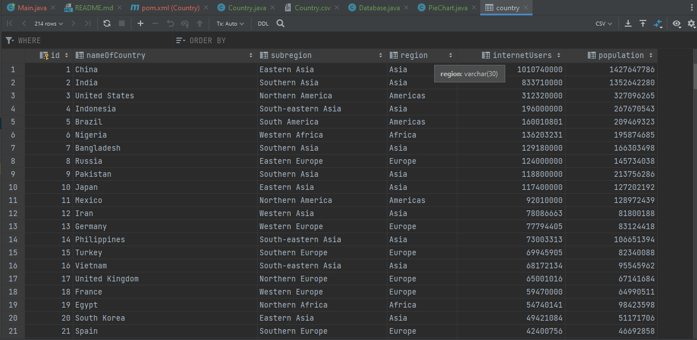

<h1>Вариант 10 Артём Вильданов</h1>

1. Создал класс Country, в котором указал необходимые поля для CSV файла.
2. Выгрузил данные из CSV файла в память оперативную память с помощью библиотеки opencsv.
3. Загрузил данные в БД SQLite с помощью sqlite-jdbc.
4. Выгрузил необходимые данные из БД и получил необходимую информацию.
5. С помощью библиотеки JFreeChart построил круговую диаграмму.